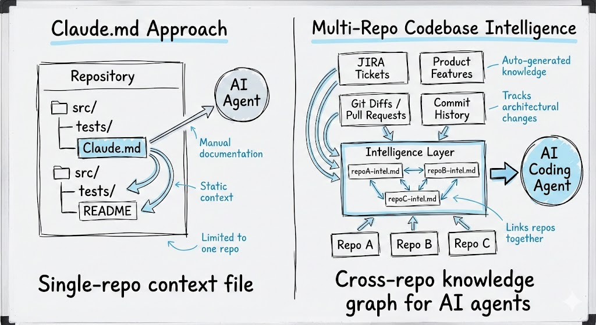

# Codebase Intelligence

A multi-repo knowledge graph for AI coding agents. Point it at your GitHub org and JIRA instance, and it builds per-repo intelligence files that accumulate architectural knowledge, patterns, gotchas, and integration points over time.



## TL;DR

A `Claude.md` file is a **point** in time — static, manual, single-repo. This tool gives you a **3D view**:

| Dimension | Source | What it provides |
|---|---|---|
| **Intent** | JIRA tickets | *Why* code was written — business context, acceptance criteria, discussion |
| **Time** | Git diffs / PR history | *How* code evolved — what changed, what patterns emerged |
| **Multi-repo** | Cross-org PR search | *Where* changes propagate — which repos are coupled, integration points |

Every ticket you analyze makes the knowledge graph richer. Running 50 tickets doesn't produce 50 thin files — it produces a few deeply-informed files that get denser with every analysis. This aligns with the [Compound Engineering](https://github.com/EveryInc/compound-engineering-plugin) philosophy: *each unit of engineering work should make subsequent units easier*.

## Inspiration

This project is inspired by Joseph Mosby's excellent article [Notes on a Multi-Repo Codebase Intelligence System](https://josephmosby.com/notes-on-a-multi-repo-codebase-intelligence-system/), which describes a GitLab + JIRA implementation. This repo adapts the approach for **GitHub** with a simplified dependency footprint.

## How It Works

1. **Sync** — Clones all repos from your GitHub org locally (subsequent runs just fetch)
2. **Fetch** — Pulls JIRA ticket metadata (summary, description, comments)
3. **Search** — Finds merged GitHub PRs across the org that reference the ticket
4. **Extract** — Gets diffs from local clones (fast, no API rate limits)
5. **Analyze** — Claude analyzes the ticket intent against the actual code changes
6. **Upsert** — Updates per-repo intelligence files, preserving and enriching existing knowledge

### Output

```
intel/
├── repos/
│   ├── api-service.md          # Architecture, patterns, gotchas, integration points
│   ├── web-frontend.md         # Accumulated knowledge from every ticket that touched it
│   └── shared-lib.md
└── tickets/
    ├── PROJ-123.md             # Intent vs. implementation analysis
    └── PROJ-456.md
```

Per-repo files accumulate sections like: Architecture, Established Patterns, Known Gotchas, Tech Debt, Integration Points, Testing Conventions, and an Intelligence Sources table tracking which tickets contributed what.

## Quick Start

### Prerequisites

- Python 3.9+
- [GitHub CLI (`gh`)](https://cli.github.com/) installed and authenticated (`gh auth login`)
- JIRA Cloud account with an [API token](https://id.atlassian.com/manage-profile/security/api-tokens)
- [Anthropic API key](https://console.anthropic.com/)

### Setup

```bash
# 1. Clone the repo
git clone https://github.com/rickmanelius/codebase-intelligence.git
cd codebase-intelligence

# 2. Create virtual environment and install dependencies
python3 -m venv .venv
source .venv/bin/activate
pip install -r requirements.txt

# 3. Configure credentials
cp .env.example .env
# Edit .env with your actual values

# 4. Validate everything is connected
python -m src --validate

# 5. Sync your org's repos locally
python -m src --sync

# 6. Analyze a ticket
python -m src PROJ-123
```

## Usage

```bash
# Analyze a single ticket
python -m src PROJ-123

# Dry run — see what would be analyzed without writing files
python -m src --dry-run PROJ-123

# Sync repos before analyzing
python -m src --sync PROJ-123

# Batch process multiple tickets (one ID per line in file)
python -m src --batch tickets.txt

# Validate all credentials
python -m src --validate
```

## Configuration

Copy `.env.example` to `.env` and fill in your values:

| Variable | Required | Default | Description |
|---|---|---|---|
| `ANTHROPIC_API_KEY` | Yes | — | Claude API key |
| `JIRA_BASE_URL` | Yes | — | JIRA instance URL (e.g., `https://yourorg.atlassian.net`) |
| `JIRA_EMAIL` | Yes | — | JIRA account email |
| `JIRA_API_TOKEN` | Yes | — | JIRA API token |
| `GITHUB_ORG` | Yes | — | Target GitHub organization |
| `CLAUDE_MODEL` | No | `claude-sonnet-4-5-20250929` | Claude model to use for analysis |
| `REPOS_DIR` | No | `./repos` | Directory for local repo clones |
| `INTEL_DIR` | No | `./intel` | Directory for output intel files |
| `DIFF_MAX_LINES` | No | `500` | Max lines per PR diff sent to Claude |

## Project Structure

```
codebase-intelligence/
├── src/
│   ├── main.py              # CLI entry point + orchestrator
│   ├── config.py            # Environment loading + validation
│   ├── writer.py            # Intel file read/write operations
│   ├── repo_sync.py         # Clone/fetch org repos (planned)
│   ├── jira_client.py       # JIRA REST API client (planned)
│   ├── github_client.py     # gh CLI wrapper + local git ops (planned)
│   ├── analyzer.py          # Claude analysis calls (planned)
│   └── templates.py         # Intel file templates (planned)
├── prompts/                  # Claude prompt templates (planned)
├── repos/                    # Local repo clones (gitignored)
├── intel/                    # Output intel files (gitignored)
├── .env.example              # Configuration template
└── requirements.txt          # Python dependencies (3 packages)
```

## Dependencies

Just 3 pip packages + the `gh` CLI:

- [`anthropic`](https://pypi.org/project/anthropic/) — Claude API SDK
- [`requests`](https://pypi.org/project/requests/) — JIRA REST API calls
- [`python-dotenv`](https://pypi.org/project/python-dotenv/) — `.env` file loading
- [`gh` CLI](https://cli.github.com/) — GitHub PR search and repo listing

## Status

This project is under active development.

- [x] **Phase 1:** Foundation — config, CLI, intel file writer
- [ ] **Phase 2:** Data fetching — repo sync, JIRA client, GitHub client
- [ ] **Phase 3:** Intelligence generation — Claude analysis + upsert prompts
- [ ] **Phase 4:** Polish — error handling, batch mode, progress logging

## License

MIT
